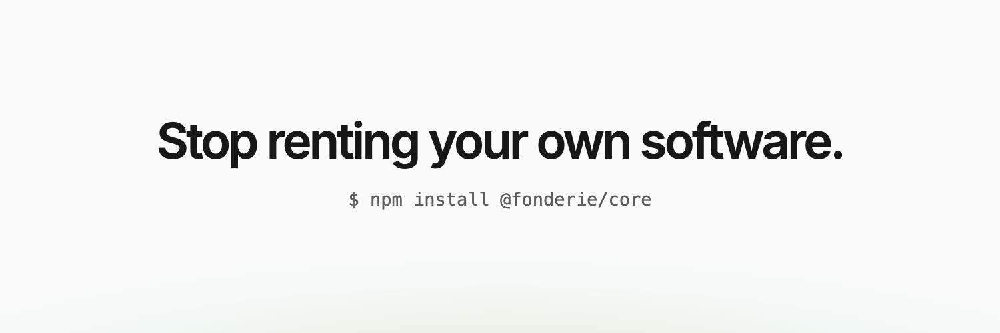
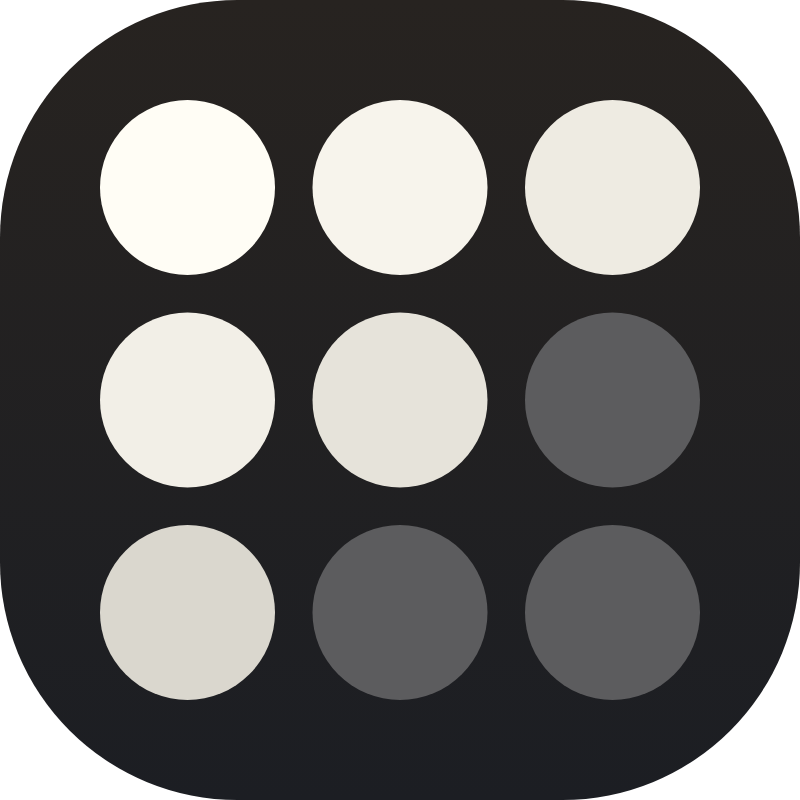
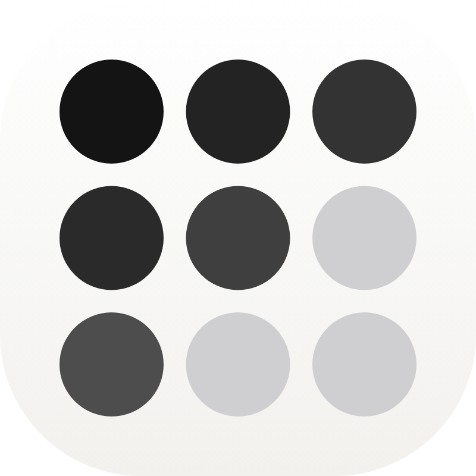
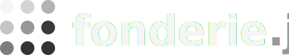

```
███████╗ ██████╗ ███╗   ██╗██████╗ ███████╗██████╗ ██╗███████╗
██╔════╝██╔═══██╗████╗  ██║██╔══██╗██╔════╝██╔══██╗██║██╔════╝
█████╗  ██║   ██║██╔██╗ ██║██║  ██║█████╗  ██████╔╝██║█████╗
██╔══╝  ██║   ██║██║╚██╗██║██║  ██║██╔══╝  ██╔══██╗██║██╔══╝
██║     ╚██████╔╝██║ ╚████║██████╔╝███████╗██║  ██║██║███████╗
╚═╝      ╚═════╝ ╚═╝  ╚═══╝╚═════╝ ╚══════╝╚═╝  ╚═╝╚═╝╚══════╝
```

# Fonderie brand

Assets and guidelines for [Fonderie](https://fonderiejs.com) — the open
foundry for casting SaaS you own.

<picture>
  <source media="(prefers-color-scheme: dark)" srcset="export/x-banner.png">
  
</picture>

<p>
  
  &nbsp;
  
</p>

<p>
  
</p>


## Wordmark & mark

- Wordmark: **fonderie.js**, always lowercase, set in Manrope Extrabold
  with tight tracking (−1.2 at display size). The `.js` renders in a muted
  tone against the solid-color `fonderie`.
- Mark: a 3×3 grid of dots in a soft light-to-dark gradient — the melt,
  cast in a lattice. `fonderie-icon-*.svg` is the bare mark (transparent
  background) for use on any surface; `favicon-dark.svg` / `favicon-light.svg`
  add the rounded-square tile for avatars, favicons, and app icons.
  `fonderie-lockup-*.svg` pairs the mark with the wordmark for headers and
  nav bars. Dark-tile favicon is primary and works on any background; the
  light tile is for print-like contexts only.

> The X banner (`export/x-banner*.png`, `export/banner-plain*.png`) still
> renders from the older Inter/melt-gradient HTML sources
> (`src/banner*.html`) — there's no SVG replacement for it yet, so it's
> temporarily out of step with the mark above. Superseding it is tracked
> as follow-up work, not an oversight.

## Color

Two schemes, same system — identical to the tokens shipped on
[fonderiejs.com](https://fonderiejs.com).

| Token | Light | Dark |
|---|---|---|
| Background | `#fafafa` | `#0a0a0a` |
| Surface | `#ffffff` | `#111111` |
| Foreground / text | `#171717` | `#ededed` |
| Muted text | `#5c5c5c` | `#a1a1aa` |
| Border | `#e0e0e0` | `#27272a` |
| Border strong | `#d4d4d4` | `#3f3f46` |
| Emerald (accent) | `#00d294` / `#009767` | `#00d294` / `#00e6a2` |
| Ember (melt glow only) | `#ff9d47` | `#ff9d47` |

The **melt** — a radial ember-to-emerald glow rising from the bottom
edge — is the one decorative motif. Ember never appears as a UI color;
it exists only inside the melt.

## Typography

- **Manrope** Extrabold for the wordmark lockup (`fonderie-lockup-*.svg`).
- **Inter** (300–600), tracking −0.05em for display sizes, −0.02em for
  body, still drives the X banner and fonderiejs.com body copy. The latin
  subset used to render the banner is in `src/inter-latin.woff2` — the
  same file fonderiejs.com serves.
- Code and terminal lines: Menlo / system monospace.

## Assets

### Source (`src/`)

| File | Use |
|---|---|
| `favicon-dark.svg` / `favicon-light.svg` | Mark on a rounded-square tile — favicons, app icons, avatars |
| `fonderie-icon-dark.svg` / `fonderie-icon-light.svg` | Bare mark, transparent background — any surface |
| `fonderie-lockup-dark.svg` / `fonderie-lockup-light.svg` | Mark + wordmark — headers, nav bars |
| `banner.html` / `banner-light.html` | X banner with tagline (1500×500, transitional — see above) |
| `banner-plain.html` / `banner-plain-light.html` | Text-free melt banner (1500×500, transitional) |

### Rendered (`export/`)

| File | Size | Use |
|---|---|---|
| `x-avatar.png` / `x-avatar-light.png` | 800×800 | Profile pictures (dark is primary) |
| `x-banner.png` / `x-banner-light.png` | 1500×500 | Headers with the tagline — fixed-crop platforms only |
| `banner-plain.png` / `banner-plain-light.png` | 1500×500 | Text-free melt — safe for platforms that crop unpredictably |

## Rebuilding

`favicon-*.svg`, `fonderie-icon-*.svg`, and `fonderie-lockup-*.svg` are
the source of truth — use them directly, no build step required.

The X banner PNGs still render from the HTML sources in `src/` with
headless Chrome:

```sh
chrome --headless --screenshot=export/x-banner.png \
  --window-size=1500,500 --hide-scrollbars src/banner.html
```

`x-avatar.png` / `x-avatar-light.png` are a plain raster of
`favicon-dark.svg` / `favicon-light.svg` at 800×800, same method:

```sh
chrome --headless --screenshot=export/x-avatar.png \
  --window-size=800,800 --hide-scrollbars \
  --default-background-color=00000000 src/favicon-dark.svg
```

## Usage

Fine: using these assets to reference, link to, or write about Fonderie.
Not fine: altering the marks, recoloring them, or using them to imply
affiliation or endorsement. When in doubt: hello@fonderiejs.com.
